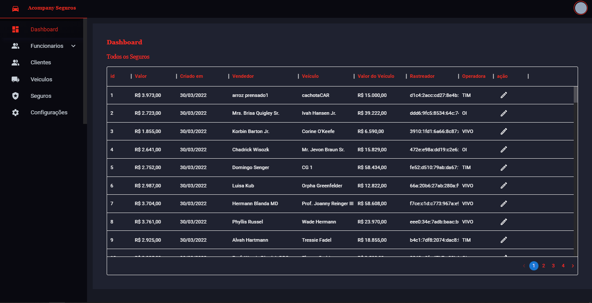
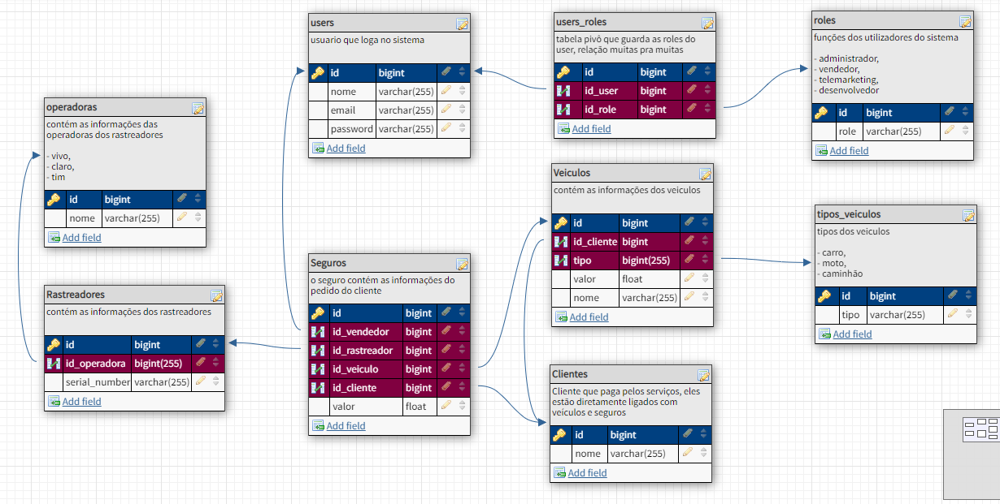
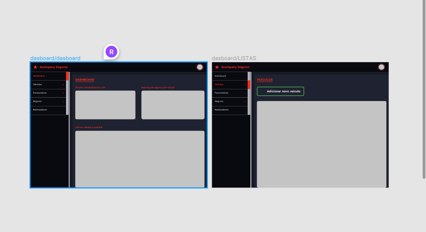
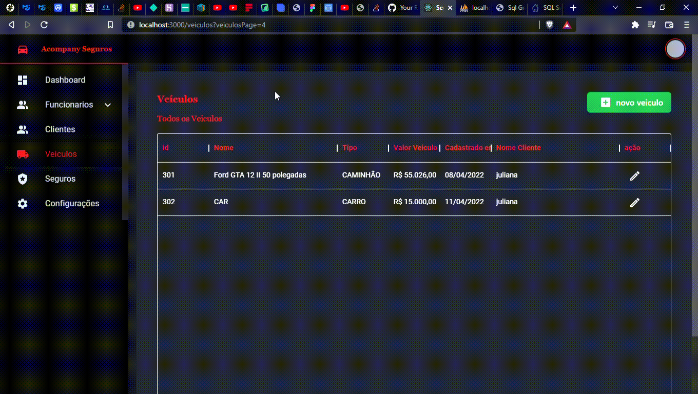

<!-- Badges session -->

  
  <!-- languages -->
  
  <!-- repo size -->
  
  <!-- last commit -->
  
  <!-- licence MIT -->
  

<!--Banner session-->

  

<!--About session-->
<h1 align="center">
    Dashboard criado para treinar minhas minhas skills nos frameworks ReactJS e Laravel como API.
</h1>

Esse dashboard foi feito através de um modelo que eu utilizava no meu antigo emprego, porém naquele sistema eu só fazia manutenções, então resolvi
aproveitar que estava precisando treinar minhas skills e resolvi utilizar todo meu empenho e habilidade para criar o sistema de seguros mais parecido
e funcional possivel com o do meu antigo e primeiro emprego na seguradora JL System.

<h3>🏠 Projeto hospedado na Netilify: </h3>

[Clique aqui, e veja como o projeto está ficando...](https://acompany-dashboard.netlify.app/)

<h3>🤓 Database planejada e arquiteturada</h3>

<h3>🤓 design feito no figma</h3>

<h3>🤓 Totalmente responsivo em todos as páginas</h3>

<h3>🏠 Criação de Recursos, veiculos, Seguros, Clientes e Usuarios</h3>

<h3>🏠 Editar Recursos</h3>

<h3>🤓 Página de 404</h3>

<h3>👨‍💻 Tecnologias utilizadas</h3>

- [HTML](https://www.w3schools.com/html/)
- [CSS](https://developer.mozilla.org/pt-BR/docs/Web/CSS)
- [JavaScript](https://developer.mozilla.org/en-US/docs/Web/JavaScript)
- [ReactJS](https://pt-br.reactjs.org/)
- [Laravel](https://laravel.com/)
- [AXIOS](https://axios-http.com/)
- [Typescript](https://www.typescriptlang.org/)
- [TailwindCSS](https://tailwindcss.com/)
- [MUI](https://mui.com/)

<!--License session-->
<h3>📝 Licença</h3>

- Este projeto está sob a licença [MIT](./LICENSE).

<h3> 🚧 Funcionalidades ainda a serem implementadas 🚧 </h3>

- Graficos para o dashboard ficar completo e mais funcional
- Excluir recursos, para o CRUD realmente ficar completo
- Campos de pesquisa nas tabelas para o dados ficarem mais dinamicos e faceis de encontrar

<!--Bottom session-->
 <h4 align=center>Feito por <a target="_blank" href="https://robert-curriculo.netlify.app/">Robert Uillians</a></h4>
